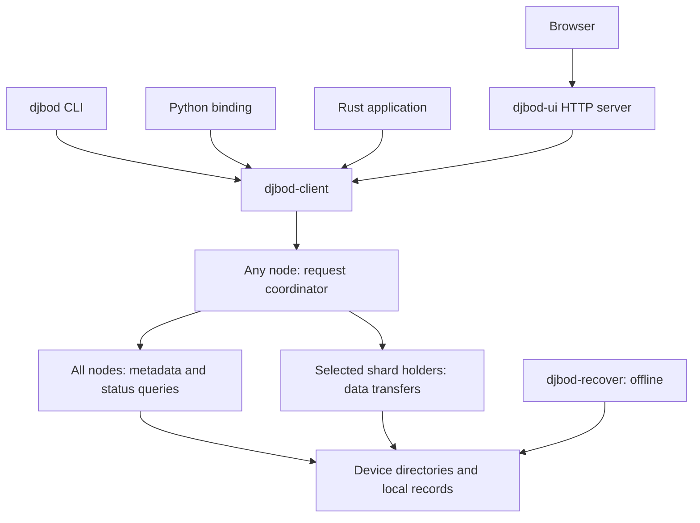

# Distributed-JBOD architecture and consequences

This document describes the implementation at commit `d9601b7` (21
September 2026), including the operational consequences of its choices.
[SPEC.md](../SPEC.md) contains the detailed format, numbered decisions,
and deferred proposals. A proposal in that specification is not a promise
that a feature exists. [Getting started](getting-started.md) provides a
hands-on walkthrough.

## Contents

- [System boundary](#system-boundary)
- [Components and responsibilities](#components-and-responsibilities)
- [State and identity](#state-and-identity)
- [Encoding and integrity](#encoding-and-integrity)
- [Placement and capacity](#placement-and-capacity)
- [Request paths](#request-paths)
- [Membership and configuration changes](#membership-and-configuration-changes)
- [Failure semantics](#failure-semantics)
- [Repair and data movement](#repair-and-data-movement)
- [Transport and trust](#transport-and-trust)
- [Resource and scaling implications](#resource-and-scaling-implications)
- [Decision consequences](#decision-consequences)
- [Implementation boundaries](#implementation-boundaries)

## System boundary

Distributed-JBOD is an object store for a pool of potentially unequal
devices on commodity machines. It accepts complete objects under keys,
erasure-codes their contents, and records exactly where their shards live.
The implementation favours an inspectable disk format, explicit errors,
and operator-directed repair.

Every storage node runs the same binary. Any node can coordinate any
client request; no permanent master or external metadata service is
required. That symmetry does **not** imply operation through arbitrary
node outages: lookups broadcast to all listed nodes and require every
response. The design separates the ability to reconstruct stored data
from the availability of normal client operations.

Clients use the native protocol through the CLI, Rust library, Python
bindings, or an administration web server. There is one object namespace,
`default`. S3 translation, mounted filesystem semantics, application
transactions, and user-visible version history are outside the current
implementation.

## Components and responsibilities



These are roles, not disjoint sets of machines: the coordinator can also
hold shards. The web server is optional and is not needed for native
clients. The recovery tool operates without the other components running.

| Crate | Responsibility | Consequence |
| --- | --- | --- |
| [`djbod-core`](../crates/djbod-core/src/lib.rs) | Device format, records, shard files, checksums, coding, local scrub | Storage and recovery share the same format implementation without networking. |
| [`djbod-proto`](../crates/djbod-proto/src/lib.rs) | Frames, handshake, request/response types | Protocol representation is separated from sockets and coordinator policy. |
| [`djbod-client`](../crates/djbod-client/src/lib.rs) | Native connections, TLS, async/blocking clients, administration procedures | CLI, UI, Python, and node-to-node communication reuse the same conversation machinery. |
| [`djbod-node`](../crates/djbod-node/src/lib.rs) | Local devices, server, request coordination, joining and startup | Each node can both serve local shards and coordinate whole objects. |
| [`djbod-cli`](../crates/djbod-cli/src/main.rs) | Shell interface and administration | Some workflows, including re-encoding, run through the administrator's client. |
| [`djbod-ui`](../crates/djbod-ui/src/lib.rs) | HTTP page/API translating actions into native operations | Browser security is a separate boundary from native TLS. |
| [`djbod-python`](../crates/djbod-python/README.md) | PyO3 wrapper of the blocking client | Python shares Rust transfer semantics, with a smaller exposed API. |
| [`djbod-recover`](../crates/djbod-recover/src/main.rs) | Direct scanning and reconstruction from device trees | Cluster configuration and running nodes are unnecessary for extraction. |

Node orchestration uses Tokio. Local format and filesystem code is largely
synchronous; asynchronous networking does not make disk I/O or erasure
coding free of CPU and blocking work.

## State and identity

### Three kinds of configuration

**Local node configuration** identifies the node UUID, listener and
advertised IP/port, state directory, device paths, bootstrap peers, TLS
file paths, and local timeouts. Command-line arguments override environment
variables, which override TOML. Paths are local facts; they are not stored
as cluster-wide device identities.

**The cluster document** is a versioned JSON document saved as
`state_dir/cluster.json` on every node. It contains the cluster UUID and
optional name, nodes and addresses, device ownership/state/labels,
default coding scheme, headroom, size limits, and transport mode. There
is no unique authoritative disk containing the only copy. The document
contains no TLS private keys.

**Per-object metadata** describes an individual body and its placement.
Every holder receives a full record, including key, size, body version,
creation time, content type, user metadata, coding parameters, whole-object
checksum, and the ordered device list for its shards. Object lookup reads
these records; the cluster document is not an object index.

Cluster/node/device UUIDs establish identity. Labels and the cluster name
are administrative display text. A device's root identity file binds it
to its cluster and device UUID, avoiding identity based on a mount path.

### Disk layout

For a nonempty object, each selected device normally stores one shard and
one metadata record:

```text
device-root/
  DISTRIBUTED-JBOD-DEVICE.json
  objects/default/ab/cd/<sha256-of-key>/
    <version-ulid>.meta.json
    <version-ulid>.<shard-index>.shard
```

The first two hash bytes form two fan-out directories. SHA-256 gives keys
filesystem-safe paths; the original key remains in the record and is
checked during lookup. It does not determine which device receives the
object. An empty object has records but no payload shard files.

A shard contains a 4096-byte header, its sequence of blocks, a footer
with geometry and the block-checksum table, and a 16-byte trailer locating
that footer. Headers and footers identify the format and body independently
of filenames. Records are checksummed JSON. The algorithms and binary
layout are format-version properties, not mutable cluster settings.

Temporary shard and record files use a `.tmp` suffix in the destination
directory. Files are completed and synced before publication by rename;
the device layer also syncs directories. Startup and scrub can remove old
temporaries after the configured age. These steps give local durability
and atomic file replacement, not an atomic transaction spanning all
devices.

See [device operations](../crates/djbod-core/src/device.rs),
[shard format](../crates/djbod-core/src/shardfile.rs), and
[metadata records](../crates/djbod-core/src/record.rs).

### Body versions and placement revisions

Each PUT receives a ULID body version. Replacing a key writes a complete
new body before cleaning up older bodies. Internal versions distinguish
in-flight writes and on-disk files; they are not retained object history.
Lookup orders versions by ULID. This ordering should not be treated as a
distributed transaction, a conditional-write primitive, or a guarantee of
wall-clock ordering between different coordinators.

A record's separate `revision` changes when shards move while the body
stays the same. Reads select the highest observed placement revision and
require all `k+m` copies of that revision to agree and come from its
listed holders. Lower revisions can remain temporarily during a move.
This makes unfinished movement visible as an inconsistency rather than
silently treating an old placement as current.

## Encoding and integrity

The code is systematic Reed-Solomon over bytes. A stripe contains up to
`k * B` input bytes, split into `k` data blocks, with `m` parity blocks
computed across them. Data shards contain original byte ranges; healthy
GETs read data blocks without parity decoding. All stripes of an object
use the same ordered set of `k+m` devices.

The final stripe is shortened and padded as required by equal-length
coding blocks. The record retains the true object size, so output excludes
padding. Coding parameters are recorded per object; changes to cluster
defaults do not make existing objects unreadable or require immediate
migration.

The supported configuration bounds are `1 <= k <= 32`, `0 <= m <= 8`,
`k+m <= 64`, and a 4096-byte-aligned block size from 64 KiB to 64 MiB.
`k=1` behaves as replication; `m=0` stores no redundancy.

XXH3-64 checks each shard block, the whole object, metadata, and shard
structure. Receivers compute checksums rather than trusting a supplied
value. Per-block verification turns detected corrupt blocks into known
erasures that repair can reconstruct. The object checksum checks the
complete reconstructed or streamed body. These are accidental-corruption
checks, not cryptographic authentication against a malicious writer.

With enough trustworthy metadata, any `k` intact blocks of a stripe can
reconstruct that stripe. `m` is consequently a shard-erasure budget, not a
host-failure budget or a guarantee that an online GET succeeds. Normal
reads do not inspect parity, so damage confined to parity may remain
unnoticed until scrub or repair examines it.

## Placement and capacity

A coordinator queries all nodes for current device space, excludes
non-active devices and those without room within headroom, then ranks
candidates by descending free bytes, breaking ties by UUID. It chooses
`k+m` distinct devices. A holder preallocates the complete shard file with
native `fallocate`; refusal can trigger selection of another eligible
device before body transfer. There is no global reservation database.

This accommodates unequal devices without fixed erasure sets. An added
device becomes a candidate for new objects once opened by its node.
Placement records preserve old locations, so adding capacity does not
itself move existing data. Larger empty disks can receive a disproportionate
share of initial writes because ranking uses absolute bytes rather than
percentage full. Simultaneous coordinators can choose the same candidates;
filesystem allocation arbitrates space, while placement does not promise
load balancing by latency, disk speed, or request count.

Two constraints limit capacity claims:

1. Each object needs enough room for a whole shard on each of `k+m`
   distinct devices. A pool can have free bytes in total and still refuse
   a write because too few individual devices qualify. An unusually large
   disk cannot absorb several shards of the same object.
2. The independence boundary is the device. Multiple shards may live on
   one host. The startup check for a shared filesystem catches some
   configuration mistakes, but not common physical failure dependencies.

For payload bytes alone, nominal encoded size is approximately
`object_size * (k+m)/k`. Headers, checksums, short-stripe padding, replicated
records, filesystem allocation, and headroom add costs. This formula is
neither a measured usable-capacity result nor evidence of throughput.

## Request paths

### PUT

```mermaid
sequenceDiagram
    participant C as Client
    participant N as Coordinator
    participant A as All nodes
    participant H as New holders
    participant O as Previous holders
    C->>N: Key, size, metadata
    N->>A: Lookup and device-space queries
    A-->>N: Records and available devices
    N->>H: Begin shards; reserve complete files
    H-->>N: Ready or refusal
    C->>N: Stream body
    N->>H: Encoded blocks, stripe by stripe
    N->>H: Finish shards, then publish records
    H-->>N: Durable acknowledgements
    N->>A: Lookup existing versions
    N->>O: Delete older versions
    N-->>C: Success with new body version
```

The new and previous holder roles can overlap. The length is required
before upload so the coordinator can
calculate geometry, choose candidates, and reserve space. File clients
stream; the CLI buffers standard input to learn its length.

Success requires all new shards and all new records to be durable, plus
completion of the replacement cleanup path. A failure is reported and
cleanup is attempted. Losing a reply after publication leaves the caller
uncertain whether the write took effect. Crashes can leave temporary files,
orphan shards, incomplete records, or more than one body version; local
atomic renames do not eliminate these distributed intermediate states.

### GET and HEAD

Lookup sends the key hash to every listed node. Each node consults local
records; the coordinator validates the original key, versions, record
checksums, and placement agreement. All nodes must answer, including
nodes that ultimately hold none of this object's shards. Only then is an
empty result authoritative.

GET streams data shards `0..k-1`, verifies their block checksums, removes
padding, and checks the whole-object checksum at the end. Missing or
corrupt required data terminates the stream with an error; there is no
inline reconstruction. The client must accept the final success status
before trusting the body, even if every byte has already arrived.

HEAD performs metadata lookup without reading payload blocks. A successful
HEAD says nothing about parity health, and cannot substitute for GET
verification or scrub.

### DELETE and LIST

DELETE looks up versions and asks their holders to delete records and
shards. It reports success only when the required deletes complete. It has
no retained delete marker or user-facing undo. Partial failure can leave
inconsistent records and needs investigation/repair before normal
operations can resume; a failed distributed mutation is not a rollback.

LIST scans records on each node, merges duplicate keys, and returns sorted
pages. Cursors are keys, not positions or server sessions. Every page is
computed again from disk; the walk is not a cluster-wide snapshot under
concurrent mutation. Pagination bounds message size and coordinator page
buffering, but does not turn a listing into an indexed lookup.

The paths above are implemented in the
[coordinator](../crates/djbod-node/src/coordinator.rs), backed by
[local operations](../crates/djbod-node/src/local_ops.rs).

## Membership and configuration changes

Ordinary cluster-document changes use a deliberately restrictive procedure:

1. Fetch the current document from every existing node. Require agreement
   on both version and content.
2. Build the next version and apply it serially in the current document's
   node order. Each node persists it before switching to it, and accepts
   only a higher version.
3. Stop at the first refusal. Success means all required nodes accepted.

The first-listed node serialises competing normal proposals: one next
version can be accepted there and a competing equal version is refused.
This is an ordering rule, not a permanent coordinator role or a
majority-quorum consensus service. Its availability requirement is all
members, and it has no distributed rollback.

A failure after some acknowledgements leaves stragglers. Node-to-node
handshakes detect differing document versions, and affected requests stop.
`cluster sync` checks the available documents and brings lagging copies
forward. Equal-version documents with different contents are refused
rather than automatically merged. Startup also consults bootstrap peers
and can adopt a newer document.

Joining and adding a device are document changes, with local identity
initialisation as well. Adding a device requires a node restart to open
the new path. Moving a node's advertised address is also a document
change, either proposed before the move or by the node at startup.
Only the first address recorded for a node is used for connections.

Forced removal is an explicit exception for a permanently unavailable
node: the client checks it does not answer, reports the estimated loss,
obtains operator confirmation, updates the remaining nodes without its
acknowledgement, and attempts to reconstruct affected objects elsewhere.
This is not an automatic failure detector that silently changes membership.
Insufficient surviving data or destination capacity can leave repairs
incomplete after membership has changed.

Unknown document fields are rejected. This prevents an older build from
silently accepting a document while discarding part of its meaning, but
means all nodes must be upgraded before using a newly introduced field.

The shared proposal procedures are in
[`djbod-client::admin`](../crates/djbod-client/src/admin.rs); node-local
joining and adoption are in
[`membership`](../crates/djbod-node/src/membership.rs).

## Failure semantics

Fail-stop means an operation reports damage, absence, or disagreement
instead of silently reconstructing or weakening its success conditions.
It does not mean a failed operation left every disk untouched.

| Event | Current behaviour | Operational consequence |
| --- | --- | --- |
| A listed node is unreachable | Metadata broadcasts and other operations requiring it fail | Unrelated objects can become unavailable; changing coordinator does not remove this dependency. |
| A required data block is corrupt | GET ends with a detailed error | Run explicit repair before expecting a normal read to work. |
| Only a parity file is corrupt/missing, but records and data are intact | A normal GET need not encounter it | Successful reads do not establish the remaining redundancy budget; scrub parity. |
| Highest-revision records are missing or disagree | Normal lookup refuses the version | Repair may complete an interrupted placement or restore missing copies under stricter trust rules. |
| A whole host is lost | Every shard on its devices is affected | More than `m` lost shards of one stripe can make that object unrecoverable. |
| Too few eligible devices or no successful reservations | PUT fails | Aggregate free bytes do not substitute for enough independent targets. |
| A configuration proposal stops midway | Nodes retain different document versions | Restore reachability and sync forward before normal operations can reliably proceed. |
| A streaming response fails late | The client may already have body bytes | Stage outputs and accept them only after a successful stream end. |
| A mutation reply is lost | The caller cannot infer whether publication happened | Inspect state before retrying; no exactly-once transaction guarantee is exposed. |

Errors can identify node/device UUIDs, object key/version, shard index,
and stripe. This detail supports diagnosis and targeted repair; it is
not a persistent damage catalogue. The current UI's remembered download
errors are transient and local to that UI process.

There are three separate thresholds for metadata and recovery:

- **Normal lookup:** all `k+m` matching record copies at the highest
  placement revision, and responses from all listed nodes.
- **Online repair:** at least `k` trustworthy record copies describing
  the same body, allowing lower revisions to corroborate that body while
  the highest revision supplies the intended placement. Disagreement is
  refused; usable blocks are still required to reconstruct each stripe.
- **Offline extraction:** a usable valid record and enough intact shard
  data among the supplied directories. It does not enforce online cluster
  membership or require `k+m` record copies.

This distinction explains why a failed online read is not proof that the
object is irretrievable, and why parity alone cannot guarantee a successful
online repair while a listed node is absent.

## Repair and data movement

### Scrub and repair

Local scrub checks records, shard structure, and every block checksum.
Cluster scrub adds agreement and placement checks across nodes. Optional
repair reconstructs affected objects. Scheduling and retaining scrub
history are the operator's responsibility; the node has no built-in
periodic scheduler in this revision.

Repair reads surviving shards and validates the reconstructed body before
writing replacements. It can rebuild corrupt/missing shards on their
current device, restore eligible missing metadata copies, finish an
interrupted move forward, and remove stale copies. Shards assigned to
devices no longer in the document can be placed elsewhere. A listed but
unreachable node remains an error until it returns or an operator takes
the permanent-removal path.

The validation pass avoids publishing a repair based on an unverified
body. It also means repair includes reading and checking surviving data,
not merely writing the missing bytes. Its duration and impact on other
work require measurement on the intended deployment.

### Move and drain

`MoveShard` produces a shard on an eligible new device, copies intact data
or reconstructs it, advances the placement revision, writes the new record
to the new holder and remaining holders, then deletes the old copy.
An interruption after some record writes makes normal reads fail until
the new revision is completed. An unreachable old device can retain a
stale copy that a later scrub finds.

Draining is separate from marking a device `draining`. The state change
stops new placement while preserving reads; drain performs a single pass
moving the device's versions and reports skipped work. Removal scans
references before accepting that a device is empty. These checks cost
metadata scans but avoid maintaining a separate reverse-placement index.

With exactly `k+m` devices, moving one shard off a device requires another
eligible device that does not already hold a shard of that object. Spare
capacity is therefore both a count of eligible devices and sufficient
space on them. A mixed-scheme cluster must satisfy each object's geometry,
not only the current default.

### Re-encoding and offline recovery

Changing the cluster scheme only affects future writes. The explicit
`cluster reencode` procedure reads objects using their stored scheme and
uploads them under the new scheme, preserving content type and user
metadata. It runs through the administration client, consumes room for old
and new versions during replacement, and generates new body versions.
Reruns skip objects already at the desired scheme. Concurrent application
mutations require operational coordination; re-encoding is not an atomic
cluster-wide migration.

Offline recovery scans device trees, selects records and shards, verifies
blocks, and reconstructs an object to a separate output file. It needs
neither running nodes nor `cluster.json` nor intact device identity files.
It still needs a usable object record and enough surviving data. A
readable format improves recovery independence, but does not recover
deleted bytes, resolve arbitrary conflicting metadata, or replace backups.

## Transport and trust

The native protocol uses TCP with a fixed 12-byte frame header, bounded
payload lengths, CBOR control messages, binary data frames, request IDs,
and explicit end-of-stream status. The Hello exchange checks protocol and
cluster identity; node peers also check document version. The body/shard
receiver times out an idle stream rather than holding an abandoned write
indefinitely. See [framing](../crates/djbod-proto/src/frame.rs) and
[connections](../crates/djbod-client/src/connection.rs).

Clients can discover the cluster UUID and try multiple node entry points.
Pinning a known UUID catches accidental connections to another cluster.
Connection failover is distinct from operation replay: streaming bodies
are not transparently restarted, and a server's explicit refusal is not
fixed by retrying another coordinator.

Transport modes are cluster configuration:

| Mode | Node-to-node traffic | Client acceptance |
| --- | --- | --- |
| `plain` | Plain TCP | Plain; TLS also accepted when the node has material loaded |
| `tls-optional` | Mutual TLS | Plain or TLS, with optional client certificate |
| `tls` | Mutual TLS | TLS with a trusted client certificate |

Certificates and private keys are provisioned externally. Nodes verify IP
subject alternative names and require suitable private-key permissions.
Rotation uses files and restarts. There is no per-client key authorisation
policy, object ACL, or certificate revocation list; authenticated clients
have administrative power. Removing a node does not revoke its certificate.
Storage encryption at rest is not implemented by the object store.

The optional UI is an HTTP service bound to loopback by default. It has
host and same-origin request checks but no login or browser-side TLS.
Deploying it beyond loopback adds an authentication/HTTPS boundary that
must be supplied separately. Its credential towards the cluster carries
the same broad authority as other clients.

## Resource and scaling implications

The architecture implies work that an evaluation should measure; it does
not establish performance rankings or measured resource requirements.

- **All-node metadata fan-out.** A key lookup involves each listed node,
  and local lookup examines its devices. Adding nodes increases both
  metadata participants and availability dependencies. There is no
  distributed placement index to route the lookup directly to holders.
- **Per-request coordination.** Whole-object traffic and coding pass
  through the selected node, including transfers to remote holders.
  Different clients can choose different coordinators, but one request
  still depends on its coordinator's resources.
- **Streaming payloads with other allocations.** Encoding works stripe by
  stripe rather than retaining a whole object. The working payload grows
  with block size and coding width. Checksum tables grow with stripe
  count, metadata has its own size, and concurrent requests multiply
  buffers: streaming does not imply constant process memory.
- **File and metadata counts.** A nonempty object creates a shard and a
  record on each holder, with a header even for a tiny payload. Inodes,
  directory walks, metadata duplication, and sync operations matter for
  small-object workloads; aggregate byte capacity alone is insufficient.
- **Scanning listings.** Key-hash directories do not preserve key order.
  Producing a page scans records and sorts keys. Repeating pages repeats
  those scans. Bounded protocol pages do not bound each node's local
  listing work to just the returned items.
- **Explicit maintenance.** Scrub reads parity that normal GETs omit.
  Drain, repair, and re-encode compete with application traffic for disk,
  network, and CPU resources. Their scheduling and headroom matter.

No benchmark results, timing estimates, throughput numbers, or claims that
one system is faster are supplied here. Performance experiments are
separate future work.

## Decision consequences

| Choice | Benefit | Cost or limitation |
| --- | --- | --- |
| Equal node roles | Any node can be an entry point; no external master service | Broadcasts still require all members; absence of a master does not provide outage tolerance. |
| Explicit per-object placement | Unequal devices and individual additions; placement can be inspected | Lookup and reverse-reference discovery require fan-out/scans. |
| Device-level independence | Works without a topology model | A host or enclosure failure can exceed an object's parity budget. |
| Erasure coding on PUT | Configurable payload redundancy rather than only full copies | Coding, multi-device placement, and reconstruction become part of normal operation/maintenance. |
| Full metadata on every holder | Recovery records survive with data; no unique object-metadata service | Duplicated records and strict agreement create more conditions that can block reads. |
| Checksums plus fail-stop reads | Damage is located and exposed to operators | Recoverable data can remain unavailable until explicit repair. |
| File-per-shard format | Ordinary files and an independent recovery tool | Small-object metadata and file overhead; no packing layer. |
| Ordered all-member document updates | Small, inspectable configuration-change procedure | Membership changes stop on an unavailable member; partial updates need forward reconciliation. |
| Separate scheme change and migration | Old and new schemes can coexist | Operators must track residual schemes and temporary capacity during migration. |
| Optional TLS with external certificates | Can migrate existing deployments to authenticated encryption | Certificate operations are external, and authorisation remains coarse. |

## Implementation boundaries

Built features include native object CRUD and listing, online and offline
scrub, explicit object repair, shard movement, drain/removal, forced node
removal, re-encoding, TLS, client libraries, and offline extraction.

Deferred work includes S3 translation, additional buckets, object
versioning, host/rack failure domains, inline read reconstruction,
automatic rebalance, built-in scrub scheduling/history, range reads,
multipart uploads, unknown-length PUT, client-side coordination, fine-grained
permissions, a sorted listing index, and packed shard storage. The
[damage-marks proposal](proposals/damage-marks.md) is not durable damage
tracking in this revision.

Implementation evidence includes
[cluster tests](../crates/djbod-node/tests/cluster.rs),
[coordinator tests](../crates/djbod-node/tests/coordinator.rs),
[TLS tests](../crates/djbod-node/tests/tls.rs),
[shard fault tests](../crates/djbod-core/tests/stripe_faults.rs), and
[offline recovery tests](../crates/djbod-recover/tests/recover.rs).
They exercise behaviour and failure handling. They are not production
experience, scale validation, or a performance comparison.
